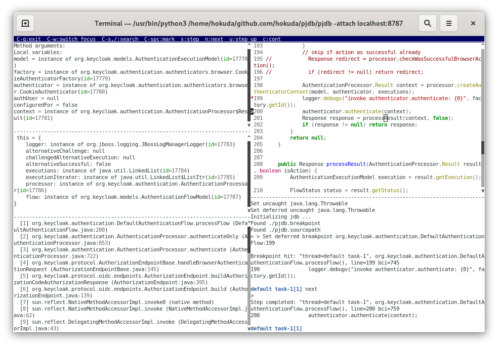

pjdb
====

[][license]

[license]: https://github.com/hokuda/pjdb/blob/master/LICENSE

A wrapper script to enhance `jdb`. It gives `jdb`:

* [`delete` command to delete break point with index](#delete-command)
* [`break` command to declare conditional break point](#break-command)
* [command history](#command-history)
* [command completion](#completion)
* [local variable name completion](#completion)
* [class name comletion](#completion)
* [field/method name completion](#completion)
* [command name abbreviation](#command-name-abbreviation)
* [reading break points in file at startup](#reading-break-points-in-file-at-startup)
* [reading sourcepath in file at startup](#reading-sourcepath-in-file-at-startup)
* [repeating the last command with enter key](#repeating-the-last-command-with-enter-key)
* and displays `list`, `where`, `locals`, `dump this` at every time a thread is suspended

Dependencies
------------

* [`rlwrap`](https://github.com/hanslub42/rlwrap) (>=0.43)
* [`python3`](https://www.python.org/)
* [`tornado`](http://www.tornadoweb.org/en/stable/)
* [`websocket-client`](https://github.com/websocket-client/websocket-client)
* [`ptterm/prompt-toolkit`](https://github.com/prompt-toolkit/ptterm)
* [`pyperclip`](https://github.com/asweigart/pyperclip)
* [`pygments`](https://github.com/pygments/pygments)

Installation
------------

* install python3

      $ sudo dnf install python3

* install rlwrap

      $ git clone https://github.com/hanslub42/rlwrap.git
      $ cd rlwrap/
      $ autoreconf --install
      $ ./configure 
      $ make
      $ sudo make install

* install tornado, websocket-client, and ptterm

      $ pip3 install --user tornado websocket-client ptterm pyperclip pygments

* install pjdb

      $ git clone https://github.com/hokuda/pjdb.git
      $ cd pjdb
      $ cp pjdb pjdb_filter ${path_to_your_favorite_bin_directory}

How to use
----------

      # pjdb [jdb options]

`pjdb` passes all options to `jdb`.

Features
--------

### `delete` command

  `delete` command shows break points with indeces. `delete #` command deletes the #th break point.

      > delete
           0 Test:22
           1 Test:23 if arg.equals("test1")
           2 Test:24
           3 Test.test()
      > delete 2
      Deleted: Test:24
      > delete
           0 Test:22
           1 Test:23 if arg.equals("test1")
           2 Test.test()
      > 

### `break` command

`break` command shows break points with indeces.

`break <class>.<method>[(argument_type,...)]` command sets a break point in a method.

`break <class>:<line>` command sets a break point at a line. A break point at a line can have a condition by using `if` in the arguments to the `break` command like `break <class>:<line> if <condition>`. `<condition>` must be a boolean Java expression.

    > break
         0 Test:22
         1 Test:23 if arg.equals("test1")
         2 Test.test()
    > break Test:24 if arg.equals("test2")
    Added "Test:24 if arg.equals("test2")"
    > break
         0 Test:22
         1 Test:23 if arg.equals("test1")
         2 Test.test()
         3 Test:24 if arg.equals("test2")
    > 

### command history

`C-r` and `C-s` are available to search history. If the `pjdb.history` file exists in the current directory, `pjdb` reads it at startup. The command history is saved when `pjdb` exits.

### completion

Hitting `TAB` key fills in the rest of an item.

### command name abbreviation

    s => step
    c => cont
    p => print
    n => next
    w => where
    d => dump
    l => list
    b => break

### reading break points in file at startup

If the `pjdb.breakpoint` file exists in the current directory, `pjdb` reads it and set break points at startup.

### reading sourcepath in file at startup

If the `pjdb.sourcepath` file exists in the current directory, `pjdb` reads it and set source paths at startup.
  
### repeating the last command with `enter` key

After executing `step`, `cont`, and `next` command, hitting `ENTER` key repeats the last command.

Author
------

Hisanobu Okuda hisanobu.okuda@gmail.com
